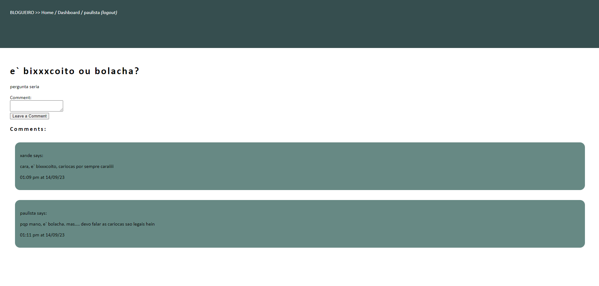

# Blogueiro



## Description
Gone are the days of incredibly low-quality forums where people would abuse each other not in real-time.  Well... I'm bringing it back, with Blogueiro!  Come chat with a select few people, just don't insult x4ndez, he's a very power-hungry moderator and will probably ban you.

## Table of Contents

1. [Developer Comments](#developer-comments)
2. [Deployed Application](#deployed-application)
3. [Usage](#usage)
4. [License](#license)
5. [Contribution](#contribution)
6. [Questions](#questions)

## Developer Comments
This was the weekly challenge for Module 14 of the edX/Monash University Full Stack Developer Bootcamp.  The challenge was to create a blog site, using recent technologies that we've been learning through the course.  I used Sequelize to handle the database because we were required to and in a short time-frame Sequelize does stream-line the process. I really liked Handlebars, the organisation of it, and how little effort some processes take.  I also used bcrypt for password hashing on the backend, and dayjs API to format dates.  Overall this was a good challenge to bring everything we've learned together, I became a lot more fluent with routing, troubleshooting issues, and passing data from front-end to back-end, and vice-versa.

The acceptance criteria of this project were as follows:

```md
GIVEN a CMS-style blog site
WHEN I visit the site for the first time
THEN I am presented with the homepage, which includes existing blog posts if any have been posted; navigation links for the homepage and the dashboard; and the option to log in
WHEN I click on the homepage option
THEN I am taken to the homepage
WHEN I click on any other links in the navigation
THEN I am prompted to either sign up or sign in
WHEN I choose to sign up
THEN I am prompted to create a username and password
WHEN I click on the sign-up button
THEN my user credentials are saved and I am logged into the site
WHEN I revisit the site at a later time and choose to sign in
THEN I am prompted to enter my username and password
WHEN I am signed in to the site
THEN I see navigation links for the homepage, the dashboard, and the option to log out
WHEN I click on the homepage option in the navigation
THEN I am taken to the homepage and presented with existing blog posts that include the post title and the date created
WHEN I click on an existing blog post
THEN I am presented with the post title, contents, post creator’s username, and date created for that post and have the option to leave a comment
WHEN I enter a comment and click on the submit button while signed in
THEN the comment is saved and the post is updated to display the comment, the comment creator’s username, and the date created
WHEN I click on the dashboard option in the navigation
THEN I am taken to the dashboard and presented with any blog posts I have already created and the option to add a new blog post
WHEN I click on the button to add a new blog post
THEN I am prompted to enter both a title and contents for my blog post
WHEN I click on the button to create a new blog post
THEN the title and contents of my post are saved and I am taken back to an updated dashboard with my new blog post
WHEN I click on one of my existing posts in the dashboard
THEN I am able to delete or update my post and taken back to an updated dashboard
WHEN I click on the logout option in the navigation
THEN I am signed out of the site
WHEN I am idle on the site for more than a set time
THEN I am able to view posts and comments but I am prompted to log in again before I can add, update, or delete posts
```

## Deployed Application
The deployed application can be viewed from the following link: <https://blogueiro-3c27fd1d5b34.herokuapp.com/>.<br>
If in future the deployed link is not in function, you can view a short walkthrough video of the application at the following link: <https://drive.google.com/file/d/1ywyuVs1IhdKt1jhdALRuAN7FPeQ6b4Z0/view?usp=sharing>.<br>
Alternatively, this walkthrough video can be downloaded from the `assets` folder of this repo.

## Usage
1. Click Login in the header to find the create an account button.
2. Input your account information, note that there are validators: usernames and emails are unique (cannot have more than one account with the same username or email), and the password must be 8 characters or longer.
3. Login with the credentials you have made.
4. Home will display all posts everyone has made, click on a post to make a comment!  You will only be able to comment if you are logged in.
5. Dashboard will display all of your posts.  This is where you can edit or delete your posts.
6. In the header you will also see your username, where you can logout of your account.

## License
<br>
This project is covered under the MIT License.

## Contribution
x4ndez: <https://github.com/x4ndez>

## Questions
Questions may be directed to my LinkedIn: <https://www.linkedin.com/in/alexandernanfro/>.